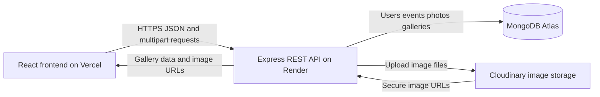

# TrizenAI Photo Sharing Platform

## Project Overview

TrizenAI is a full-stack photo-sharing platform for professional events. Event administrators create events, assign team members, review uploaded photos, select the photos to publish, and share a PIN-protected public gallery. Customers can access only the selected photos from a published gallery.

### Main Workflows

- **Admin:** register, create events, create and assign team members, review uploads, select photos, and publish galleries.
- **Team member:** log in, view assigned events, upload event photos, and view personal uploads.
- **Customer:** open a public gallery link, verify the gallery PIN, and view selected photos with event details.

## Technology Stack

### Frontend

- React 19
- React Router
- Vite
- Axios
- Oxlint

### Backend

- Node.js
- Express
- Mongoose
- JWT authentication
- bcryptjs password hashing
- Multer multipart upload handling
- Helmet and CORS

### Infrastructure

- MongoDB Atlas for production data persistence
- MongoDB Memory Server for automated integration tests
- Cloudinary for production image storage
- Render for the Express API
- Vercel for the React frontend

## System Architecture

The browser communicates with the Express API through JSON and multipart HTTP requests. The API authenticates users with JWTs, stores application records in MongoDB, and sends uploaded images to Cloudinary. Public gallery access uses a gallery-specific token issued after successful PIN verification.



   Simple view of the same architecture:

   ```text
   Customer/Admin/Team Member
          |
          v
   React + Vite frontend (Vercel)
          |
          v
   Express REST API (Render)
       /       \
      v         v
   MongoDB Atlas  Cloudinary
    users, events,  uploaded images
    photos, galleries
   ```

### Authorization Model

- JWTs identify authenticated users.
- Passwords are stored as bcrypt hashes, never as plain text.
- Admin-only operations include event creation, member assignment, photo selection, and gallery publishing.
- Team members can upload only to events assigned to them.
- Team members can view only their own uploads through event photo endpoints.
- Public gallery photos require a valid short-lived gallery access token created after PIN verification.

## Database Design

MongoDB stores four primary collections:

### User

Stores `name`, normalized `email`, `passwordHash`, and `role`. Roles are `ADMIN` and `TEAM_MEMBER`.

### Event

Stores the event `name`, `description`, `date`, the creating admin, and references to assigned team members.

### Photo

Stores the event reference, uploader reference, original filename, file size, Cloudinary `publicId`, image URL, and `isSelected` state.

### Gallery

Stores the event reference, public gallery token, bcrypt-hashed PIN, publication state, and publication timestamp. The PIN itself is never stored.

## Repository Structure

```text
client/                 React/Vite frontend
   src/pages/             Login, dashboards, event, and gallery pages
   src/services/api.js    Axios API client
server/                 Express backend
   src/controllers/       Request handlers
   src/models/            Mongoose schemas
   src/routes/            API route definitions
   src/middleware/        Authentication and event access checks
   test/                  Backend integration tests
```

## Local Setup

### Prerequisites

- Node.js 18 or newer
- npm
- MongoDB Atlas or a local MongoDB instance for persistent local data
- Cloudinary account for real image storage

### Install Dependencies

From the repository root:

```powershell
cd server
npm install

cd ..\client
npm install
```

### Configure the Backend

Copy the example file:

```powershell
Copy-Item server\.env.example server\.env
```

Set the values in `server/.env`:

```env
PORT=5000
MONGO_URI=mongodb_connection_string
JWT_SECRET=long_random_secret
CLOUDINARY_CLOUD_NAME=cloudinary_cloud_name
CLOUDINARY_API_KEY=cloudinary_api_key
CLOUDINARY_API_SECRET=cloudinary_api_secret
CLIENT_URL=http://localhost:5173
```

Never commit `server/.env` or place real credentials in documentation.

### Start the Applications

Use two terminals:

```powershell
# Terminal 1
cd server
npm run dev
```

```powershell
# Terminal 2
cd client
npm run dev
```

Open [http://localhost:5173](http://localhost:5173). The backend health endpoint is available at [http://localhost:5000/api/health](http://localhost:5000/api/health).

The client defaults to `http://localhost:5000/api` when `VITE_API_URL` is not set. For local development, `CLIENT_URL` should remain `http://localhost:5173`.

## Environment Variables

### Backend

| Variable | Purpose |
| --- | --- |
| `PORT` | Port used by the Express server locally. Render supplies its own port in production. |
| `MONGO_URI` | MongoDB connection string. |
| `JWT_SECRET` | Secret used to sign authentication tokens. |
| `CLOUDINARY_CLOUD_NAME` | Cloudinary cloud identifier. |
| `CLOUDINARY_API_KEY` | Cloudinary API key. |
| `CLOUDINARY_API_SECRET` | Cloudinary API secret. |
| `CLIENT_URL` | Allowed frontend origin and base URL for generated gallery links. |

### Frontend

Set this in Vercel for Production and Preview deployments:

```env
VITE_API_URL=https://your-render-service.onrender.com/api
```

The `/api` suffix is required for frontend API requests. `CLIENT_URL` must contain only the frontend origin, without `/login`, `/gallery`, or `/api`.

## Testing and Validation

Run backend integration tests:

```powershell
cd server
npm test
```

Run frontend linting and the production build:

```powershell
cd client
npm run lint
npm run build
```

The integration suite covers authentication, event authorization, duplicate team-member handling, uploads, photo selection, gallery publication, PIN verification, and public gallery access.

## Deployment

### Deploy the API to Render

1. Push the repository to GitHub.
2. Create a Render **Web Service** from the repository.
3. Set the root directory to `server`.
4. Use `npm install` as the build command.
5. Use `npm start` as the start command.
6. Add the backend environment variables in the Render dashboard.
7. Set `CLIENT_URL` to the final Vercel frontend origin.
8. Confirm the service with `/api/health`.

### Deploy the Frontend to Vercel

1. Import the GitHub repository into Vercel.
2. Set the root directory to `client`.
3. Use the Vite preset with `npm run build` and `dist` as the output directory.
4. Add `VITE_API_URL` with the deployed Render API URL and `/api` suffix.
5. Deploy and open the generated Vercel URL.
6. Update Render's `CLIENT_URL` with that exact Vercel URL and redeploy the API if necessary.

### Production Checklist

- Add the Render service IP access rule required by MongoDB Atlas.
- Configure Cloudinary credentials for real image uploads.
- Confirm CORS allows the deployed Vercel origin.
- Test admin, team-member, upload, selection, publication, PIN, and direct gallery-link flows.
- Rotate any credentials that were accidentally exposed during development.
- Keep all `.env` files out of Git.

## Known Limitations

- No real-time upload progress indicator.
- No image editing, cropping, or transformations in the application UI.
- No automatic AI tagging or duplicate detection.
- No pagination or advanced search for large event galleries.
- Gallery access tokens are held in server memory, so active tokens are lost when the Render instance restarts.
- The free Render instance can sleep after inactivity, causing a slow first request.
- Local fallback image URLs are intended for development and testing, not production storage.

## Future Improvements

- Persist gallery access sessions in Redis or MongoDB.
- Add thumbnail generation and responsive image transformations.
- Add bulk selection, downloads, and gallery expiration.
- Add upload progress and retry handling.
- Add automated deployment and security checks in CI.
